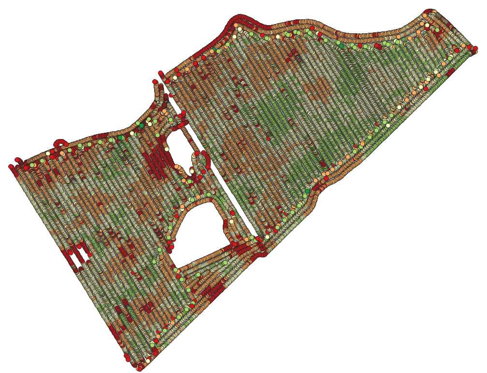
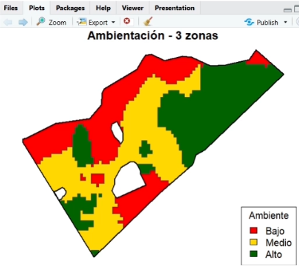
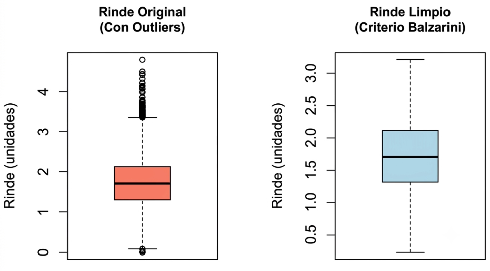
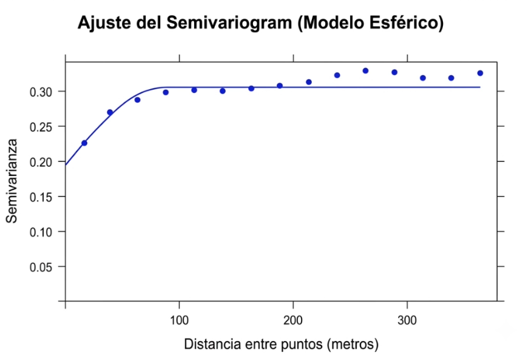
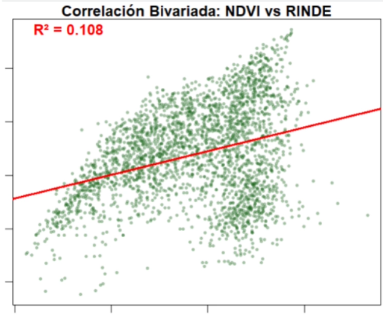
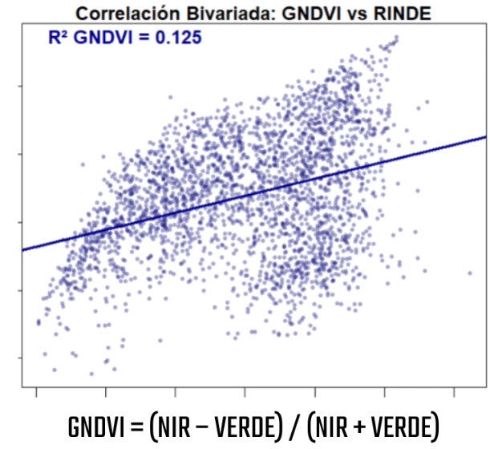

# 🌾 Mapa de Rendimiento

Pipeline de procesamiento de datos de cosecha (yield monitor) para transformar el archivo crudo de la cosechadora en un mapa de rendimiento limpio, interpolado y segmentado en zonas de manejo — y validarlo contra índices de vegetación satelitales (NDVI / GNDVI).

## 📌 Contexto

El archivo que entrega la cosechadora **no sale listo para usar**. Cada punto georreferenciado de rinde viene con errores de medición propios del proceso de cosecha: frenadas y arranques de la máquina, solapamiento entre pasadas, y ruido del sensor de flujo de grano. El resultado crudo (*mapa crudo*) está lleno de valores anómalos que distorsionan cualquier análisis posterior.

Este repositorio documenta el flujo completo:

1. **Limpieza** de outliers
2. **Completado** del mapa mediante interpolación geoestadística (kriging)
3. **Zonificación** en zonas de manejo
4. **Validación** contra NDVI/GNDVI satelital

---

## 🗺️ Resultado final

| Mapa de rinde crudo | Mapa de rinde ambientado (zonas de manejo) |
|---|---|
|  |  |

De un mapa de puntos ruidoso, directo de la cosechadora, a zonas de manejo delimitadas y listas para tomar decisiones agronómicas. Los pasos de abajo explican cómo se llega de uno al otro.

---

## 1. Limpieza de outliers

Se evalúa qué tan lejos está cada punto del comportamiento general de la distribución (criterio Balzarini). Si un punto es estadísticamente demasiado raro, se descarta bajo el supuesto de que corresponde a un error de máquina y no a una variación real de rendimiento.

| Rinde Original (con outliers) | Rinde Limpio (criterio Balzarini) |
|---|---|
| Puntos sueltos muy por arriba y por abajo del rango normal | Distribución mucho más pareja, sin valores extremos |

<p align="center"></p>

---

## 2. Variograma

Antes de interpolar, se necesita entender **cómo varía el rinde en función de la distancia** entre puntos del mapa crudo. Para eso se ajusta un semivariograma (modelo esférico), que muestra que la semivarianza crece con la distancia hasta estabilizarse en una meseta (*sill*) — es decir, a partir de cierta distancia los puntos dejan de estar espacialmente correlacionados.

<p align="center"></p>

Este ajuste es el insumo necesario para el paso siguiente: el kriging.

---

## 3. Kriging (interpolación)

El kriging convierte la **capa de puntos** en una **capa raster continua**. Usando el modelo de variograma ajustado, revisa los vecinos de cada celda vacía y calcula un promedio ponderado por distancia para completar el mapa.

Resultado: un raster continuo de rendimiento, sin huecos, listo para delimitar zonas de manejo.

---

## 4. Zonas de manejo

El raster de kriging se procesa con un **doble filtro de suavizado** para eliminar micro-variabilidad y generar polígonos de zonas de manejo (alto / medio / bajo rendimiento) con sentido agronómico y operativo.

---

## 5. Validación contra NDVI / GNDVI satelital

Una vez generado el mapa de rinde limpio, se lo compara contra imágenes satelitales para evaluar si el vigor vegetativo (verde de la planta) predice el rendimiento real de cosecha.

### NDVI vs Rinde

<p align="center"></p>

- **R² = 0.108** → el NDVI explica ~10% de la variación del rinde en este lote.

### GNDVI vs Rinde

<p align="center"></p>

- **R² = 0.125**
- Fórmula: `GNDVI = (NIR − Verde) / (NIR + Verde)`
- Fórmula NDVI clásico: `NDVI = (NIR − Rojo) / (NIR + Rojo)`

#### Diferencia práctica entre NDVI y GNDVI

El rojo es absorbido muy fuertemente por la clorofila incluso en plantas con poco contenido clorofílico. Por eso el **NDVI se satura rápido** cuando el cultivo ya tiene buena cobertura y biomasa alta, perdiendo capacidad de discriminar diferencias con el dosel denso.

El verde es absorbido de forma más moderada, así que el **GNDVI mantiene mejor sensibilidad** en etapas más avanzadas del cultivo o con mayor densidad foliar. Se asocia más específicamente al contenido de clorofila y al estado nutricional (sobre todo nitrógeno) que a la biomasa total.

| Índice | Mejor uso |
|---|---|
| NDVI | Etapas tempranas, detectar presencia/ausencia de vegetación, delimitar zonas de manejo en general |
| GNDVI | Cultivo bien desarrollado, diferenciar estado nutricional o estrés en dosel cerrado (donde NDVI ya está saturado) |

Un R² de 0.125 es demasiado bajo para usar el GNDVI de esta fecha como variable de ambientación de forma aislada.

### Rangos orientativos de R² en correlaciones índice–rinde

| R² | Interpretación |
|---|---|
| < 0.20 | Muy bajo — relación casi inexistente o con mucho ruido |
| 0.20 – 0.40 | Bajo — tendencia débil, no confiable para tomar decisiones |
| 0.40 – 0.60 | Moderado — útil como variable complementaria |
| 0.60 – 0.75 | Bueno — el índice explica bien la variabilidad del lote |
| > 0.75 | Muy bueno — fuerte relación, viable para ambientación directa |

Por eso el enfoque de **ambientación multivariada** (combinando varios índices + suelo + topografía) suele dar resultados mucho más robustos que cualquier correlación bivariada individual.

> **Nota:** el NDVI utilizado para esta correlación corresponde a una fecha/práctico distinto del NDVI usado en el práctico de ambientación general, por lo que los valores no son directamente comparables entre ambos análisis.

---

## 🔁 Resumen del flujo

```
Archivo crudo cosechadora (puntos)
        │
        ▼
Limpieza de outliers (criterio Balzarini)
        │
        ▼
Variograma → ajuste modelo esférico
        │
        ▼
Kriging → raster de rinde interpolado
        │
        ▼
Zonas de manejo (doble filtro de suavizado)
        │
        ▼
Validación vs NDVI / GNDVI satelital
```

Este flujo permite confirmar con **datos reales de cosecha** si la zonificación por imagen satelital tiene sentido agronómico, o si el rendimiento depende de otros factores además del vigor vegetativo detectado por el índice.

---

## 🛠️ Stack

- R (`gstat`, `sf`, `terra`, `ggplot2`)
- QGIS
- Google Earth Engine (NDVI/GNDVI, Sentinel-2)

## 📂 Estructura sugerida del repo

```
├── data/
│   ├── raw/              # datos crudos de la cosechadora
│   └── processed/        # datos limpios y zonas de manejo
├── scripts/
│   ├── 01_limpieza.R
│   ├── 02_variograma_kriging.R
│   ├── 03_zonas_manejo.R
│   └── 04_validacion_ndvi.R
├── capturas/              # mapas, boxplots, variograma, correlaciones
└── README.md
```
